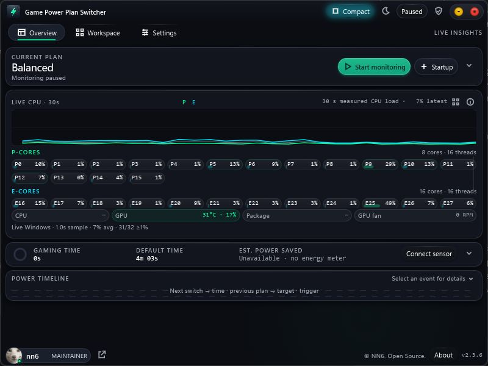
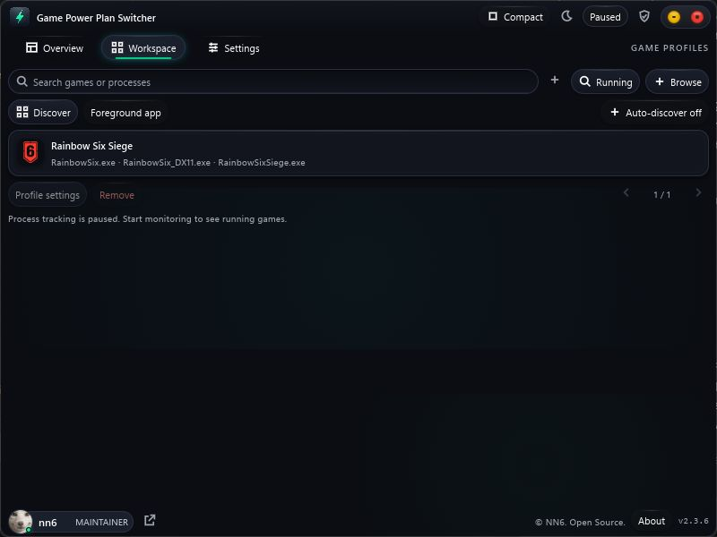

# Game Power Plan Switcher

**Signing status: Unsigned · Verify SHA-256** — release v2.3.7. The release includes a signing pipeline for future signed builds; no publisher certificate has been configured.

**Automatically switch Windows power plans when your games start and stop.**

Choose a Gaming plan, choose a Default plan, and add your games. This small native Windows app handles the switch and switches back when you finish. No Steam dependency.

[Download v2.3.7](https://github.com/112-stack/game-power-plan-switcher/releases/tag/v2.3.7) · [Overview](docs/OVERVIEW.md) · [Full guide](docs/Game-Power-Plan-Switcher-Full-Guide.pdf) · [Changelog](CHANGELOG.md)



The screenshots and PDF guides show the 2.3.6 interface. They illustrate the shared workflow; the [language guide](docs/LOCALIZATION.md) covers 2.3.7 changes. Their historical test results are not new release verification.

## What it does

- **Automatic switching:** any watched game running selects Gaming; the last one closing restores Default. Optional battery, time and foreground rules let you adjust that behavior.
- **A workspace for your games:** add executable names, browse for a game or review discovered launcher entries. Give individual games their own plan if needed.
- **Useful live information:** CPU activity, topology-aware core groups, available GPU sensors and a power-transition timeline.
- **Everyday controls:** tray actions, a global shortcut, optional startup at user logon, searchable plan pickers and CSV/JSON session export.
- **Native and local:** Rust, C++23 and Slint. One GUI per user/session, with a separate engine and recovery guardian.



## Get started

1. Download `Game-Power-Plan-Switcher-2.3.7.exe` from the release. Windows 10/11 x64 and a compatible OpenGL driver are required.
2. In **Settings**, select your installed Gaming and Default plans. The app does not supply a custom gaming plan. Use `powercfg /list` to see what is installed.
3. In **Workspace**, add the game’s actual `.exe` name. Rainbow Six Siege aliases are included initially; replace them or add other games.
4. Select **Start monitoring**. Close goes to the tray by default. **Pause** or **Exit** restores Default; enable **Startup** to run at your next logon.

To look around without changing power plans or startup settings:

```powershell
.\Game-Power-Plan-Switcher-2.3.7.exe --dry-run --start-paused
```

Preview uses separate settings and engine connections. An older monitor requires an explicit handover before normal monitoring begins.

## Your language, automatically

Version 2.3.7 follows your Windows display language with **English, Arabic, Spanish, Brazilian Portuguese, French, German, Russian and Simplified Chinese** built in. No setup or download is needed. Use the globe button or **Settings → Window & keys → Language** to choose another language; your choice is remembered.

**System default** checks Windows at startup and responds to language-setting change notifications. An explicit language stays selected until you change it. Unsupported languages fall back to English, and only the selected Rust catalog is parsed when needed.

Arabic labels support right alignment and mixed-direction text; the window is not fully mirrored. Technical names and some diagnostics retain their original language. Native-speaker improvements to these starter translations are welcome. [Language guide](docs/LOCALIZATION.md).

## Same app, clearer name

Version 2.3.6 renames **NN6 Power Plan** to **Game Power Plan Switcher**. Existing settings, startup registration and recovery connections retain their internal names for compatibility. Copyright credits and prior license grants remain intact. The fresh repository began with version 2.3.6; version 2.3.7 adds automatic language support and release-verification tooling. Historical engineering notes remain version-specific records.

## A few honest limits

Power plans are preferences, not an FPS guarantee. CPU/package temperatures need an existing LibreHardwareMonitor or OpenHardwareMonitor provider; unsupported readings stay unavailable. Energy savings are not estimated. The app does not inject into games or read their memory, but it is not anti-cheat certified.

The published Windows executable is **unsigned**. Keep Windows security protections enabled and read the version-specific verification report for the checks actually run and their limits. Signing scripts do not make an existing download signed.

## Verify your download

Use the verification script from source you trust, with the EXE, manifest and checksums from the same release:

```powershell
.\tools\Verify-Download.ps1 -ExePath .\Game-Power-Plan-Switcher-2.3.7.exe `
  -ManifestPath .\Game-Power-Plan-Switcher-2.3.7-release-manifest.json `
  -ChecksumPath .\Game-Power-Plan-Switcher-2.3.7-checksums.txt -AllowUnsigned
```

The explicit **`-AllowUnsigned`** flag matches this release's unsigned status. Without a separately verified Sigstore bundle, the result is **INTEGRITY-ONLY**, not publisher authentication. Omit the flag when checking a future Authenticode-signed release; unsigned files then fail verification. A verified Sigstore bundle can authenticate the manifest's expected signer while the EXE remains Authenticode-unsigned. Both the EXE and manifest checksums are checked; a matching set alone does not establish who published it. Obtain the reference through a trusted channel.

The default inspection does not run the downloaded EXE or download trust material. Windows signature checks use local certificate/revocation caches; unavailable trust evidence fails verification. `-RunManifestCheck` is an explicit extra step requiring a valid Authenticode signature **and** either a separately obtained `-ExpectedSignerThumbprint` or a verified Sigstore identity. Any valid signature is not enough to authorize executing a download. [TRUST.md](TRUST.md) explains each result, optional offline Sigstore verification, and the Bash verifier for macOS/Linux.

A future signed release can still receive a SmartScreen **unrecognized app** prompt while reputation develops; a valid, trusted signature identifies its publisher. This differs from **Unknown Publisher** and EV certificates do not bypass SmartScreen. Verify the source and signature before proceeding. [Microsoft's reputation guidance](https://learn.microsoft.com/en-us/windows/apps/package-and-deploy/smartscreen-reputation).

## Build and contribute

Follow [CONTRIBUTING.md](CONTRIBUTING.md) for the pinned Windows build and [ROADMAP.md](ROADMAP.md) for useful next steps. Small fixes, clear bug reports and hardware test results are welcome.

Publishers can use the separate [post-build signing workflow](RELEASE-SECURITY.md#code-signing-and-smartscreen). Ordinary builds require no certificate. Change the signing-status label to **Signed · Authenticode · Timestamped** only after the actual release passes all signing and timestamp checks.

The source is **GPL-3.0-or-later**; the combined Slint distribution uses GPLv3. See [LICENSE.txt](LICENSE.txt), [NOTICE.txt](NOTICE.txt) and [publication notes](docs/PUBLICATION.md). Built by [nn6](https://discord.com/users/176078095957098497). No affiliation with game publishers or hardware vendors.
