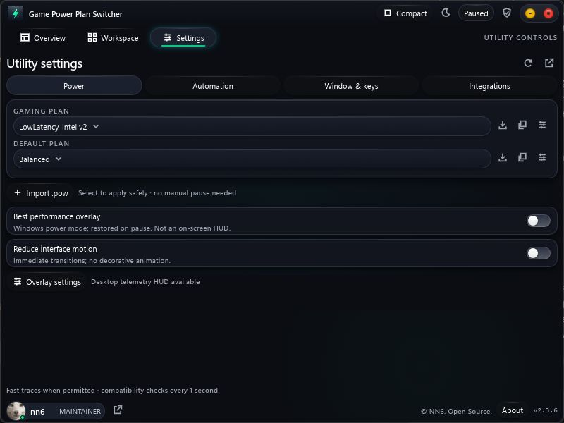

# Release notes and publishing scope

## 2.3.7 — automatic language support

Version 2.3.7 adds automatic Windows display-language selection, a saved language override, eight bundled interface/tray languages and release-verification tooling. The downloadable executable is `Game-Power-Plan-Switcher-2.3.7.exe`. It remains unsigned because no publisher certificate is configured.

Use the 2.3.7 release's own checksums, matching source and version-specific verification report. Do not substitute an older binary hash or infer new hardware, performance, anti-cheat or signing certification from this update. Publication follows the retained GPL notices and keeps private development evidence and credentials out of the public package.

## 2.3.6 — publication history

This release adopts **Game Power Plan Switcher** as the public product name. The project lives at [112-stack/game-power-plan-switcher](https://github.com/112-stack/game-power-plan-switcher). The release executable is `Game-Power-Plan-Switcher-2.3.6.exe`.

The rename covers the application’s visible product identity and project documentation. Existing `NN6` data directories, IPC identities, startup registration and diagnostic environment variables are retained for compatibility. NN6 remains the credited author. GPL permissions, historical notices and prior license grants are preserved.

That publication started from a fresh `main` root and distributed **2.3.6 only**. Earlier Git history, tags and release downloads are not part of the fresh project. Historical changelog entries, source attribution and recorded test results remain as context; they do not promise access to superseded binaries.

The executable remains unsigned. Use the **2.3.6** release checksums and its version-specific verification report; the older hash and test results below are historical evidence for different bytes. No new performance, cross-hardware, anti-cheat or signing claim follows from the rename.

## 2.3.5 — publication history

NN6 Power Plan Native **2.3.5** was built and tested locally on October 6, 2026. Its initial public repository added presentation and community files without changing the compiled application. The following records describe that earlier distribution, which is not included in this fresh publication.

The original unsigned executable’s SHA-256 is:

```text
a7543fff5ceb3b13d333162ca6efc2932a96a3e95eb957b051f30ec7089114df
```

Its embedded Git commit is `unknown`, because that verified build preceded its original repository. A later Git tag does not retroactively add provenance to those bytes. The old hash is historical identification only; obtain the current executable and corresponding source from the 2.3.7 release.

That earlier source archive preserved its original verified source and local-release documentation. At initial publication, Rust, C++, Slint, Cargo.lock, build.rs, icons and the embedded third-party notice remained byte-identical to the verified build inputs. The third-party notice’s older heading was retained because that file is embedded; its upstream licenses still apply. These historical statements are not byte-equality claims about later application revisions.

## Screenshots and guides

The Overview, Workspace and Settings images are real captures of the **2.3.6** application, retained as workflow illustrations. Monitoring was paused; available CPU and GPU readings reflect the capture time. Unavailable readings remain unavailable. The pointer is kept outside the app window. No private desktop, account paths or synthetic benchmark values are included.



The PDF guides describe version **2.3.6** and remain useful for the shared workflow. They were not regenerated or retested for 2.3.7. Their checks apply only to the recorded version and binary; use [LOCALIZATION.md](LOCALIZATION.md) for current language behavior and the 2.3.7 release report for current verification.

## License and policy review

- NN6’s original source is GPL-3.0-or-later. The combined Slint build uses GPLv3; applicable upstream notices and the prior MIT grant remain available.
- The Kinetic Squircle is original project artwork. The supplied avatar and game-identification artwork retain their respective rights; the GPL grant does not claim ownership of them. See [NOTICE.txt](../NOTICE.txt).
- The initial curated source scan found no credentials or real workstation paths. Historical private diagnostics and local caches are excluded.
- Binaries and dependency archives are release downloads, not committed build output. Release files must remain within GitHub’s asset limits.
- No GitHub approval, antivirus certification, anti-cheat certification, performance guarantee or complete legal clearance is claimed.

Reviewed against [GitHub’s acceptable-use rules](https://docs.github.com/en/site-policy/acceptable-use-policies/github-acceptable-use-policies), [repository licensing guidance](https://docs.github.com/en/repositories/managing-your-repositorys-settings-and-features/customizing-your-repository/licensing-a-repository) and [release documentation](https://docs.github.com/en/repositories/releasing-projects-on-github/about-releases). The publisher remains responsible for rights to distributed material.
